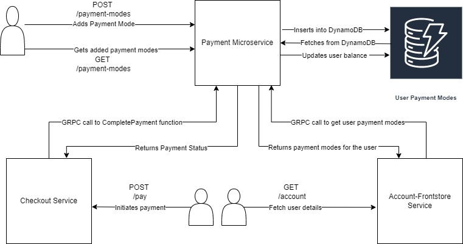
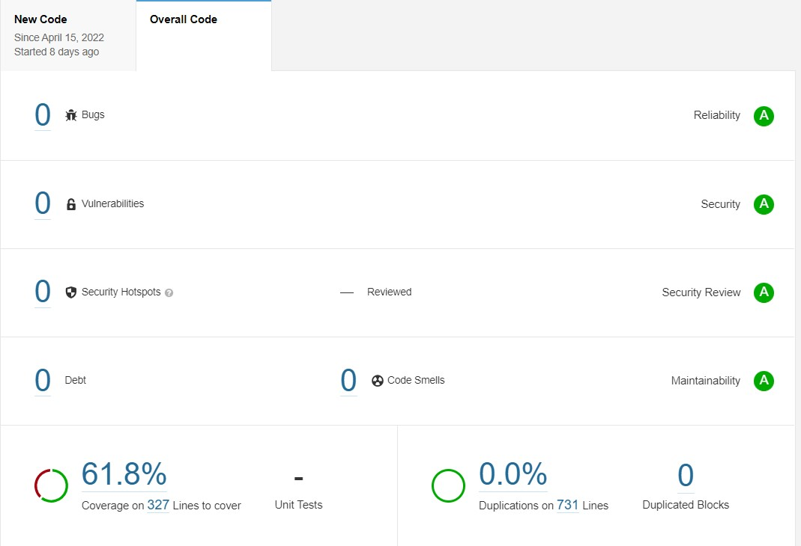

# Mode of Payment service

# Responsibilities
1) Allow user to add and retrieve mode of payments for his account.
2) Allow user to select one of the payment mode to initiate a payment request.
3) Check balance amount for the give payment mode selected.

# REST endpoints exposed
1) [POST] - AddPaymentMode   - http://localhost:9000/api/paymentmethods
2) [GET]  - GetPaymentModes  - http://localhost:9000/api/paymentmethods
3) [POST] - CompletePayment  - http://localhost:9000/api/pay
4) [GET]  - HealthCheckAPI   - http://localhost:9000/api/paymentmethods/health

# Steps to run application
1) Using docker
   1) 
      `docker build --tag payment-mode -t payment-mode .`
   2) `docker run -d -p 9000:9000 payment-mode ` 

2) Run locally
   1) `cd payment-mode` 
   2) `go build`
   3) `./payment-mode`
   
# Features Implemented
1) HealthCheck API
2) Swagger documentation - http://localhost:9000/api/swagger/index.html
3) Dockerized the application
4) Implemented REST endpoints using DynamoDB.
5) Unit tests for controller layer and service layer using gomock and testify
6) Jenkinsfile for CI/CD pipeline.
7) Sonarqube to calculate code coverage.
8) GRPC service methods
9) Reduced docker image size from 1GB to 50 MB using multi-stage build.

# Architecture

# Sonarqube Reports

